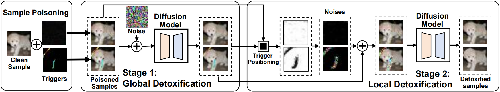

# SampDetox: Black-box Backdoor Defense via Perturbation-based Sample Detoxification

## Introduction
This repository includes the implementation for our paper "SampDetox: Black-box Backdoor Defense via Perturbation-based Sample Detoxification" accepted by NeurIPS 2024.

## Installation
This project is built upon the following environment:
* python 3.8
* CUDA 11.3
* Pytorch 1.11.0
## Diffusion Model
Train a diffusion model on the CIFAR-10 dataset by
```
python ./diffusion/traindiffusion.py
```
## Defense
Defense against BadNets
```
python SampDetox.py --against badnet
```
## Acknowledgement
Part of the code is borrowed from [**BackdoorBench**](https://github.com/SCLBD/BackdoorBench),thanks to their great work!
## Citation
If you find our work insight or useful, please consider citing:
```
@inproceedings{SampDetox,
  author       = {Yanxin Yang, Chentao Jia, DengKe Yan, Ming Hu, Tianlin Li, Xiaofei Xie, Xian Wei, Mingsong Chen},
  title        = {SampDetox: Black-box Backdoor Defense via Perturbation-based Sample Detoxification},
  booktitle    = {Proceedings of Neural Information Processing Systems (NeurIPS)},
  year         = {2024},
}
```
